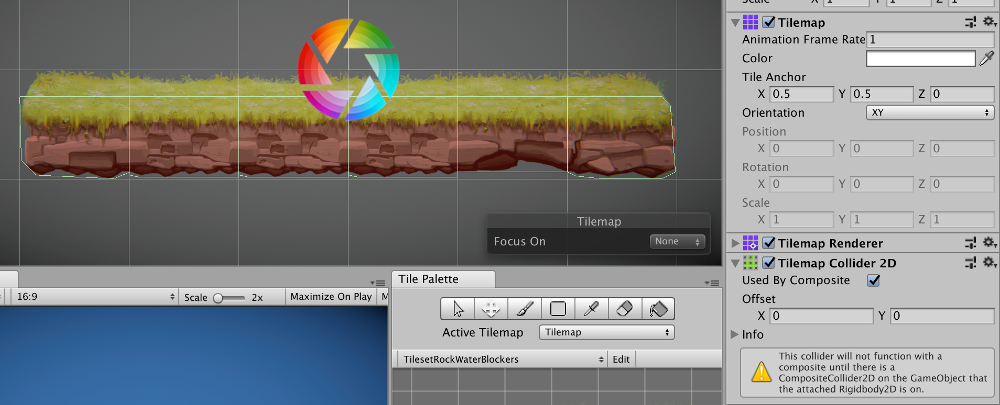

Tilemaps are a very common technique in 2D development. It's consisting of regrouping level, theme or items in the same regular shaped image. It make it easier to build a consistent 2D game world and made game development more accessible, faster and performant.

Since Unity 2017.2, tilemap has finaly became a part of the Unity 2D integrate dev tool. Before this version, you needed your own custom tilemap system. 

Sadly Unity still need some time to optimize his tilemap feature since they are still few bugs remaning from previsous version (tilemap palette don't show off, brush not optimize etc.). 

It's also missing some explanation about the tilemaps collision system in the case of a 2d platformer.

## Improving collision system 

### Context

For example, you are making a 2d platformer like Super Mario Bros. First of all, you create your spritesheet and decide to add it to unity. After importing your sprite sheet, you create your first tilemap. By doing this, unity create a Timemap object within a Grid object. Since you now that this tilemap will by use to collide with your character, you also add a TilemapCollider2d component to it. It seems logical since the name is cleary made to manage collision.

### Create

Great ! You can now easily create your own game world. You select the brush icon, create a small platform, add your character and Voilà. You got a first implementation of your game.

### To many colliders

Event if everything look fine, if you take a closer look at your tilemap, you will see that there is a lot of collider. TilemapCollider2D is pretty simple, it create a collider for every tiles. For example, if you put 6 tiles one after the other, you will get 6 box collider. All those collider can be painfull since your character can trip over the junction between two collider.

### A solution ?

The best solution is to add a CompositeCollider2D to your tilemap. You will also need RigidBody2D by the way since CompositeCollider2D need a rigidbody to work properly. Set the body type of the RigidBody2D to static since you don't want your tilemap to be impact by the physic.

But what is the role of a CompositeCollider2D ? It pretty simple, a CompositeCollider2D will merge every box collider that got a junction with an another one. To make it clear, in our first example below, when we got 6 box collider for 6 tiles, now we will have only a single collider for the 6 tiles.

### But what happens when the collider shape isn't good ? 

Or you want a more complex collising physics shape ? There's already a solution for that. You simply need to edit the physics shapes of your sprite in the sprite editor windows.

## Conclusion

Unity's tilemap system can help you gain a lot of time but need some tweaking to get want you really want.
