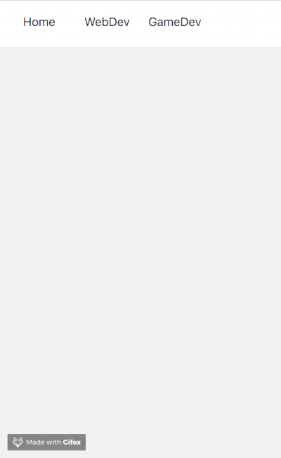
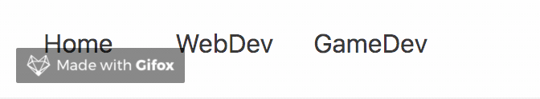

# A brief explanation

In the version 16.3, React decide to release the final version of his context api. Finally, it's no more experimental. For the one who do not know React's context api, we can read in the official documentation that *Context is designed to share data that be considered "global" for a tree of React component*. 

To make it short, I can say that Context is someking of a lightweight version of Redux. Because we can use it to achieve the same thing for some basic usage. You can read this [great article by Didier FRANC](https://medium.freecodecamp.org/replacing-redux-with-the-new-react-context-api-8f5d01a00e8c) that explane how we can replace Redux with react-waterfall (that use context api).

# Context vs Redux : a really brief comparaison

Since I don't want to make an article about Context vs Redux, I will just let keep list has brief as possible.

Redux's advantage

* Powerfull developper tools
* Great community
* Lots of extensions 

Context's advantage

* Light
* Native
* Easy to use
* No extra dependencies

Now that this is done, I will tell how I use context api with this blog.

# Everything is about context

My blog is pretty dawn simple, I got a homepage, a page about my web dev articles and a last one about my game dev articles. My stack is also pretty simple, I use [Gatsbyjs](https://www.gatsbyjs.org/), a static site generator for React, coupled with [styled-components](https://www.styled-components.com/), a css-in-js library. I try to keep it stupid, simple (**KISS** if you prefer). 

I wanted to keep my code simple has possible. I didn't use Redux because it was kinda heavy for a such small blog. But I also need something to manage my global state to avoid React's old state propagation pattern. So I decide to use React Context Api.

## And the context ?

I can said that my blog got two context, one for the web dev and one for the game dev. With that in my mind, I got the following idear. When the use put in mouse of the web dev or game dev menu entrie, a small preview of my profile will slide down. I throught it could be a got idear to show the skill I learn in both of those word.



 

For this, I will need a small store that look like this

* **Context** a flag value (webdev or gamedev) 
* **profileEnable** does my profile is displayed 

# Provinding (creating globally) everything

Context api work by using two components

**Provider** *A React component that allows Consumers to subscribe to context changes*.

**Consumer** *A React component that subscribes to context changes*.

It will sound familiar to you if you are used to Redux.

## Before provinding everything

Before creating my variable and function that are gonna by used by the Context Api, I create two external file:

`src/context/appContext` is use to import the global Context Api. It will create both Provider and Consumer for the AppContext variable.

```javascript
// src/context/appContext
import React from 'react';

const AppContext = React.createContext();

export default AppContext;

```

`src/context/appConstant` is use to flag all the app's context

```javascript
// src/context/appConstant
const CONTEXT = {
  WEBDEV: 'webdev',
  GAMEDEV: 'gamedev'
};

export default CONTEXT;

```

## Provinding everything

Like Didier Franc already explain in his article, creating a global store can by easy by linking our context why the main state of our main div. That why, all data of my store are managed by `src/layout/index` , my main div.

```javascript
  // src/layout/index

  /**
   * @constructor
   * @param {object} props
   */
  constructor (props) {
    super(props);
	// here are all my data
    this.state = {
      context: CONTEXT.GAMEDEV,
      profileEnable: false
    };
  }
```

I did the same thing for my reducers, that are just internal functions of `src/layout/index`.

```javascript
  /**
   * Update home context
   * @param {string} context
   */
  toggleContext = (context) => {
    this.setState({
      context
    });
  }

  /**
   * Show profile preview or not
   * @param {bool} profileEnable
   */
  toggleProfile = (profileEnable, context) => {
    this.setState({
      profileEnable,
      context
    });
  }
```

And finally, I pass everything to the Context api's provider component `AppContext.Provider`

```javascript
  /**
   * render
   */
  render () {
    const { children } = this.props;

    // helmet
    const siteTitle = get(this.props, 'data.site.siteMetadata.title');
    const meta = [
      { name: 'description', content: 'Hi folks' },
      { name: 'keywords', content: 'blog, react, unity, front-end, game design' }
    ];

    // merging into a single store
    const store = {
      ...this.state,
      toggleContext: this.toggleContext,
      toggleProfile: this.toggleProfile
    };

    return (
      <div>
        <Helmet title={siteTitle} meta={meta}>
          <link rel="icon" type="image/png" href={Favicon} sizes="16x16" />
        </Helmet>
        
        {/* Passing my store data to context api */}
        <AppContext.Provider value={{ ...store }}>
          <Navbar />
          <Profile />
          <div>
            {children()}
          </div>
          <Social />
        </AppContext.Provider>
      
	  </div>
    );
  }
}
```

That, I got now a global store with

* **context** has flag variable for webdev and gamedev
* **profileEnable** to display/hide the profile preview
* **ToggleContext** to unleash an action and update the context
* **toggleProfile** to update profileEnable function

# Consume (or getting) everything

Now that all my data are stored, I need to get them or update them. This is when the Consumer component can be used. Consumer, beside of Provider, need a function has a child. This function is used to get the data that we had pass through provider.

In my profile component, I only need to get data, so it gonna look like this when using Consumer.

```javascript
// src/components/profile/profile
/**
 * Avatar picture
 * @param {bool}    enable
 * @param {string}  context
 */
const Profile = () => (
  <AppContext.Consumer>
    {({ profileEnable, context }) => {
      const left = (context === CONTEXT.WEBDEV) ? '27px' : '118px';
      return (
        <SlideVertical from="-520px" to="0px" active={profileEnable} zIndex="1">
          <Wrapper left={left}>
            {context === CONTEXT.WEBDEV && <WebdevProfile />}
            {context === CONTEXT.GAMEDEV && <GamedevProfile />}
          </Wrapper>
        </SlideVertical>
      );
    }}
  </AppContext.Consumer>
);
```


## Updating the store

Like you saw in `src/components/profile/profile`, consumer is used to get variable, it also can be used to get function like **toggleContext** and **toggleProfile**. Since we get those function, we simple gonna call them when we need to update the local state of our main div `src/layout/index` and when it gonna update, it will also update our AppContext.Provider and update everything at the end.

```javascript
  // src/components/interactions/commonLink
  render () {
    const { children, url, context, hasProfile } = this.props;
    return (
      <AppContext.Consumer>
        {({ toggleContext, toggleProfile }) => (
          <Fragment>
            {hasProfile &&
              <MenuLink
                onClick={this.handleClick(url, context, toggleContext)}
                onMouseEnter={this.handleMouseEnter(toggleProfile, context)}
                onMouseLeave={this.handleMouseLeave(toggleProfile, context)}
              >
                {children || url}
              </MenuLink>
            }

            {!hasProfile &&
              <MenuLink onClick={this.handleClick(url, context, toggleContext)} >
                {children || url}
              </MenuLink>
            }
          </Fragment>
        )}
      </AppContext.Consumer>
    );
  }
```

`this.handleMouseEnter` and `this.handleMouseLeave` are function that return an another function. I did it this way to set a timer before updating the provider (since I wanted my link animation to finish before displaying the profile).



It's also a great way to add some logic before calling a callback

```javascript
  /**
   * Show profile on mouse enter
   * @param {function} callback
   * @param {string}   context
   */
  handleMouseEnter = (callback, context) => () => {
    this.setState({
      isMouseIn: true
    });
    setTimeout(() => {
      if (this.state.isMouseIn) {
        callback(true, context);
      }
    }, 500);
  };

  /**
   * hide profile on mouse leave
   * @param {function} callback
   * @param {string}   context
   */
  handleMouseLeave = (callback, context) => () => {
    this.setState({
      isMouseIn: false
    });
    callback(false, context);
  };
```


# Conclusion

That pretty much. I can conclude that React's new Context is easy to learn and can be usefull for simple and small project. But I could'nt tell if it can be the best solution for a more larger project that a small blog.

